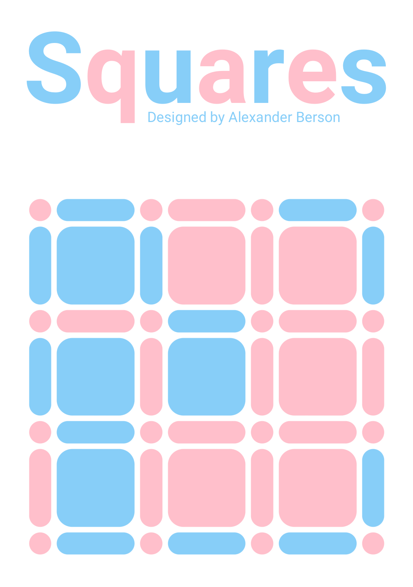

# Squares

Complete more squares than your opponent.  
You can [play Squares against the AI online](https://alex-berson.github.io/squares/) or  

## Description

**Squares** (also known as **Dots and Boxes**, **Boxes**, **Dots and Dashes**, **Dots**, **Smart Dots**, or, simply, the **Dot Game**) is a strategic pencil-and-paper game for two players. 

The game starts with an empty grid of dots, which can be of any size: 3x3, 4x4, 5x5... Each player, in turn, draws a horizontal or vertical line connecting two adjacent dots. Whenever placement of a line completes a single 1x1 square, the square is colored in and the player having completed the square receives an additional move. The game ends when no more lines can be placed.

The player who completes the most squares wins.

## Screenshot

  

## License

Copyright &copy; 2022 Alexander Berson. This project is licensed under the [MIT license](LICENSE.txt "MIT License").

